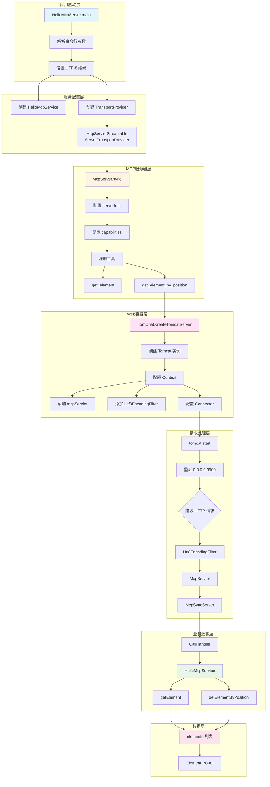
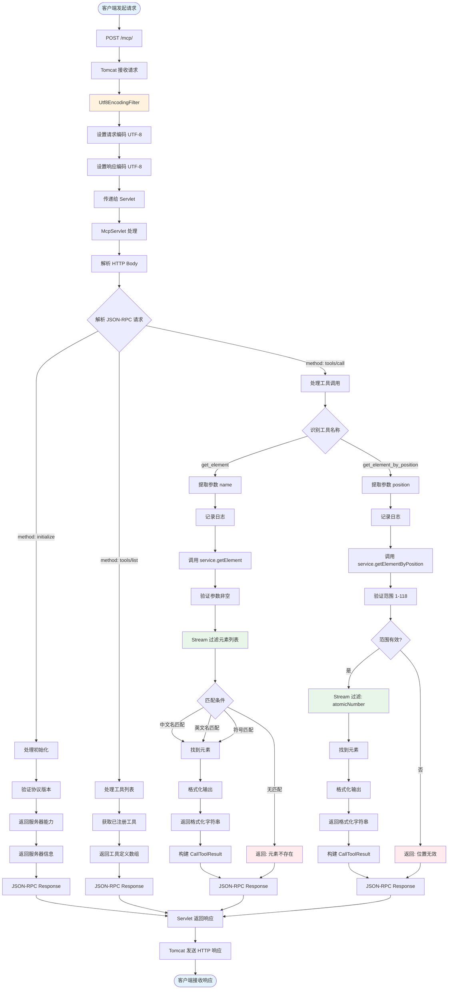
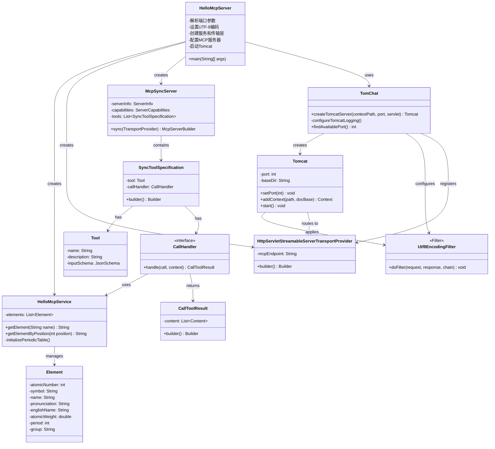

# Hello MCP Java Server 详细流程图

## 完整的请求响应流程

```mermaid
sequenceDiagram
    autonumber
    participant Client as MCP客户端
    participant Tomcat as Tomcat容器
    participant Filter as Utf8EncodingFilter
    participant Servlet as McpServlet
    participant Server as McpSyncServer
    participant Handler as CallHandler
    participant Service as HelloMcpService
    participant Data as 元素周期表数据

    Note over Data: 静态初始化块加载118个元素数据

    rect rgb(240, 248, 255)
        Note over Client,Server: 阶段1: 服务器启动与初始化
        Note over Tomcat: main 方法启动，解析端口参数
        Tomcat->>Service: 创建 HelloMcpService
        activate Service
        
        Tomcat->>Servlet: 创建 TransportProvider
        activate Servlet
        Note over Servlet: mcpEndpoint 设置为 mcp/
        
        Tomcat->>Server: 创建 McpServer.sync
        activate Server
        Note over Server: 配置服务器信息和能力
        
        Server->>Server: 注册工具 get_element
        Note over Server: 工具1: 根据名称查询元素
        
        Server->>Handler: 注册 callHandler
        activate Handler
        
        Server->>Server: 注册工具 get_element_by_position
        Note over Server: 工具2: 根据序号查询元素
        
        Server->>Handler: 注册 callHandler
        
        Tomcat->>Tomcat: 创建 Tomcat 实例
        Note over Tomcat: 配置端口 9900
        
        Tomcat->>Tomcat: 配置 Context
        Tomcat->>Servlet: 添加 mcpServlet
        Note over Servlet: 映射路径为 /*
        
        Tomcat->>Filter: 添加 Utf8EncodingFilter
        activate Filter
        Note over Filter: 设置 UTF-8 编码过滤器
        
        Tomcat->>Tomcat: 配置 Connector
        Note over Tomcat: 设置 URI 编码为 UTF-8
        
        Tomcat->>Tomcat: tomcat.start
        Note over Tomcat: 服务器启动完成，监听 9900
    end

    rect rgb(255, 250, 240)
        Note over Client,Server: 阶段2: 初始化握手
        Client->>Tomcat: POST /mcp/ 发送 initialize 请求
        activate Tomcat
        Note over Client: JSON-RPC 2.0 initialize 方法
        
        Tomcat->>Filter: doFilter
        activate Filter
        Filter->>Filter: 设置请求和响应编码为 UTF-8
        Filter->>Servlet: filterChain.doFilter
        deactivate Filter
        
        activate Servlet
        Servlet->>Servlet: 解析 HTTP 请求体
        Servlet->>Server: 处理 initialize 请求
        activate Server
        
        Server->>Server: 验证协议版本
        Server->>Server: 协商能力
        
        Server-->>Servlet: 返回 InitializeResult
        Note over Server: 包含协议版本、能力和服务器信息
        deactivate Server
        
        Servlet-->>Tomcat: JSON-RPC Response
        deactivate Servlet
        Tomcat-->>Client: 200 OK 返回初始化结果
        deactivate Tomcat
    end

    rect rgb(240, 255, 240)
        Note over Client,Server: 阶段3: 工具列表查询
        Client->>Tomcat: POST /mcp/ 发送 tools/list 请求
        activate Tomcat
        
        Tomcat->>Filter: doFilter
        activate Filter
        Filter->>Servlet: 应用 UTF-8 编码
        deactivate Filter
        
        activate Servlet
        Servlet->>Server: 处理 tools/list 请求
        activate Server
        
        Server->>Server: 获取已注册工具列表
        
        Server-->>Servlet: 返回 ListToolsResult
        Note over Server: 包含两个工具的定义和参数 schema
        deactivate Server
        
        Servlet-->>Tomcat: JSON-RPC Response
        deactivate Servlet
        Tomcat-->>Client: 200 OK 返回工具列表
        deactivate Tomcat
    end

    rect rgb(255, 240, 245)
        Note over Client,Data: 阶段4: 工具调用 get_element
        Client->>Tomcat: POST /mcp/ 调用 get_element
        activate Tomcat
        Note over Client: 参数 name 可以是中文名、英文名或符号
        
        Tomcat->>Filter: doFilter
        activate Filter
        Filter->>Servlet: 应用 UTF-8 编码
        deactivate Filter
        
        activate Servlet
        Servlet->>Server: 处理 tools/call 请求
        activate Server
        
        Server->>Server: 识别工具名称 get_element
        Server->>Handler: 调用 callHandler
        activate Handler
        
        Handler->>Handler: 提取参数 name
        Note over Handler: 从 context.arguments 获取
        
        Handler->>Handler: 记录日志
        Note over Handler: 包含 sessionId 和参数值
        
        Handler->>Service: 调用 getElement(name)
        activate Service
        
        Service->>Service: 验证参数非空
        Service->>Data: 使用 Stream API 查询
        activate Data
        Note over Data: 匹配中文名、英文名或符号
        
        Data-->>Service: 返回匹配的元素
        deactivate Data
        
        Service->>Service: 格式化返回结果
        Note over Service: 包含元素的所有属性信息
        
        Service-->>Handler: 返回格式化字符串
        deactivate Service
        
        Handler->>Handler: 构建 CallToolResult
        Note over Handler: 使用 Builder 模式
        
        Handler-->>Server: 返回 CallToolResult
        deactivate Handler
        
        Server-->>Servlet: JSON-RPC Response
        deactivate Server
        
        Servlet-->>Tomcat: 响应数据
        deactivate Servlet
        Tomcat-->>Client: 200 OK 返回元素信息
        deactivate Tomcat
    end

    rect rgb(255, 255, 240)
        Note over Client,Data: 阶段5: 工具调用 get_element_by_position
        Client->>Tomcat: POST /mcp/ 调用 get_element_by_position
        activate Tomcat
        Note over Client: 参数 position 为原子序数 1-118
        
        Tomcat->>Filter: doFilter
        activate Filter
        Filter->>Servlet: 应用 UTF-8 编码
        deactivate Filter
        
        activate Servlet
        Servlet->>Server: 处理 tools/call 请求
        activate Server
        
        Server->>Server: 识别工具名称 get_element_by_position
        Server->>Handler: 调用 callHandler
        activate Handler
        
        Handler->>Handler: 提取参数 position
        Note over Handler: 转换为 int 类型
        
        Handler->>Handler: 记录日志
        
        Handler->>Service: 调用 getElementByPosition(position)
        activate Service
        
        Service->>Service: 验证参数范围 1-118
        Service->>Data: 使用 Stream API 查询
        activate Data
        Note over Data: 匹配 atomicNumber 等于 position
        
        Data-->>Service: 返回匹配的元素
        deactivate Data
        
        Service->>Service: 格式化返回结果
        
        Service-->>Handler: 返回格式化字符串
        deactivate Service
        
        Handler->>Handler: 构建 CallToolResult
        Handler-->>Server: 返回 CallToolResult
        deactivate Handler
        
        Server-->>Servlet: JSON-RPC Response
        deactivate Server
        
        Servlet-->>Tomcat: 响应数据
        deactivate Servlet
        Tomcat-->>Client: 200 OK 返回元素信息
        deactivate Tomcat
    end

    rect rgb(255, 240, 240)
        Note over Client,Server: 阶段6: 连接关闭
        Client->>Tomcat: 关闭 HTTP 连接
        Note over Tomcat: 无需特殊清理，HTTP 连接自动关闭
        deactivate Handler
        deactivate Filter
        deactivate Service
        deactivate Servlet
        deactivate Server
    end
```




## 架构组件说明




## 数据流转详解




## 核心类关系图




## 关键技术点

### 1. HTTP Servlet 通信机制
- 使用 Tomcat 作为 Web 容器
- 通过 HttpServletStreamableServerTransportProvider 处理 MCP 协议
- 所有请求通过 POST /mcp/ 端点接收
- 支持异步处理 (asyncSupported: true)
- 异步超时设置为 3000ms

### 2. UTF-8 编码处理
Java 实现特别注重 UTF-8 编码的完整支持：
- **系统级别**: 设置 System.out 和 System.err 的编码
- **Tomcat 级别**: 配置 Connector 的 URIEncoding 和 useBodyEncodingForURI
- **过滤器级别**: Utf8EncodingFilter 统一设置请求/响应编码
- **日志级别**: 配置 ConsoleHandler 使用 UTF-8 编码

### 3. JSON-RPC 2.0 协议
- 所有请求/响应遵循 JSON-RPC 2.0 规范
- 包含 jsonrpc、id、method、params 字段
- 支持错误处理机制
- 通过 HTTP POST 传输

### 4. MCP 协议实现
- 实现了 initialize 握手
- 实现了 tools/list 工具发现
- 实现了 tools/call 工具执行
- 使用同步模式 (McpSyncServer)

### 5. 工具注册机制
使用 Builder 模式构建工具规范：
```java
SyncToolSpecification.builder()
    .tool(Tool.builder()
        .name("get_element")
        .description("...")
        .inputSchema(new JsonSchema(...))
        .build())
    .callHandler((call, context) -> {
        // 处理逻辑
        return CallToolResult.builder()
            .addTextContent(result)
            .build();
    })
    .build()
```

### 6. 数据查询逻辑
- 静态初始化 118 个元素数据
- 使用 Java Stream API 进行查询
- 支持多种查询方式（中文名/英文名/符号/序号）
- 使用 String.format 格式化输出

### 7. Tomcat 容器配置
- 动态创建 Context 和 Wrapper
- 配置 Servlet 映射和过滤器
- 支持异步 Servlet
- 自定义日志配置

## Java vs Kotlin 实现对比

| 特性 | Java 实现 | Kotlin 实现 |
|------|----------|-------------|
| **Web容器** | Tomcat (Servlet) | Ktor (SSE) |
| **通信方式** | HTTP POST | SSE + POST |
| **端口** | 9900 | 3001 |
| **端点** | /mcp/ | /sse + /message |
| **会话管理** | 无需显式管理 | sessionId 管理 |
| **编码处理** | 多层次 UTF-8 配置 | 简单配置 |
| **工具注册** | Builder 模式 | DSL 风格 |
| **数据查询** | Stream API | Collection 操作 |
| **日志** | SLF4J + Logback | KotlinLogging |
| **异步支持** | Servlet 异步 | Coroutines |

## 请求流程对比

### Java 流程
```
Client → Tomcat → Filter → Servlet → McpSyncServer → CallHandler → Service → Data
```

### Kotlin 流程
```
Client → SSE/POST → SseServerTransport → Server → Lambda Handler → Service → Data
```

## 主要差异

### 1. 通信协议
- **Java**: 标准 HTTP POST，每次请求独立
- **Kotlin**: SSE 长连接 + POST 消息，保持会话状态

### 2. 容器选择
- **Java**: 使用成熟的 Tomcat Servlet 容器
- **Kotlin**: 使用轻量级的 Ktor 框架

### 3. 编码处理
- **Java**: 需要在多个层次配置 UTF-8（系统、容器、过滤器）
- **Kotlin**: 相对简单的编码配置

### 4. 代码风格
- **Java**: 传统的 Builder 模式，显式类型
- **Kotlin**: DSL 风格，类型推断，更简洁

### 5. 会话管理
- **Java**: 无状态，每次请求独立处理
- **Kotlin**: 有状态，通过 sessionId 管理连接

## 总结

两种实现都提供了相同的功能（查询元素周期表），但采用了不同的技术栈和架构风格：

- **Java 实现**更传统和企业级，使用标准的 Servlet 容器，适合需要稳定性和广泛支持的场景
- **Kotlin 实现**更现代和简洁，使用协程和 SSE，适合需要实时通信和高并发的场景

两者都完整实现了 MCP 协议规范，提供了工具注册、调用和响应的完整流程。
