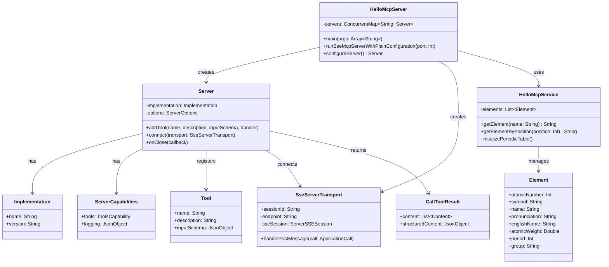

# Hello MCP Kotlin Server 详细流程图

## 完整的请求响应流程

## 架构组件说明

## 数据流转详解

## 核心类关系图

## 关键技术点

### 1. SSE (Server-Sent Events) 通信机制
- 使用 Ktor SSE 插件建立长连接
- 客户端通过 GET /sse 建立连接
- 服务器通过 POST /message 接收消息
- 每个连接有唯一的 sessionId

### 2. JSON-RPC 2.0 协议
- 所有请求/响应遵循 JSON-RPC 2.0 规范
- 包含 jsonrpc、id、method、params 字段
- 支持错误处理机制

### 3. MCP 协议实现
- 实现了 initialize 握手
- 实现了 tools/list 工具发现
- 实现了 tools/call 工具执行

### 4. 工具注册机制
- 使用 server.addTool() 注册工具
- 定义工具名称、描述、输入 schema
- 提供 lambda 处理函数

### 5. 数据查询逻辑
- 静态初始化 118 个元素数据
- 支持多种查询方式（中文名/英文名/符号/序号）
- 使用 Kotlin 集合操作进行高效查询
