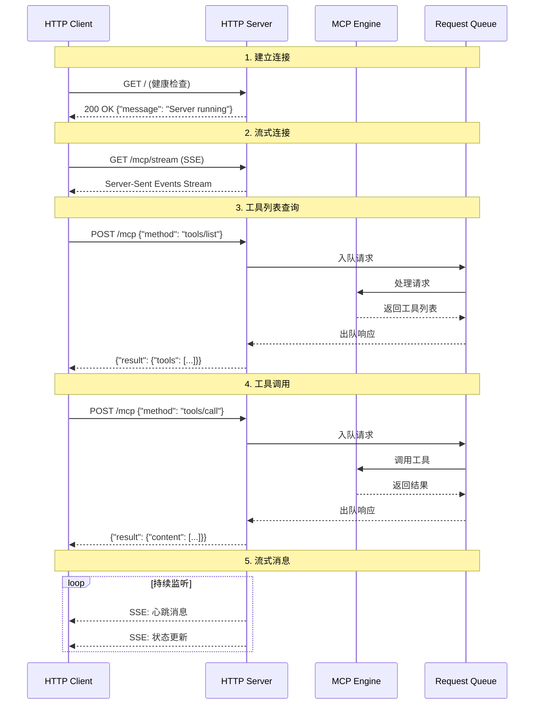

# MCP Streamable HTTP Implementation

这是一个使用 **Streamable HTTP** 方式实现的 Model Context Protocol (MCP) 服务器和客户端的完整示例。该实现展示了如何通过 HTTP 协议进行实时、流式的 MCP 通信。

## 🚀 项目概述

本项目实现了：
- **HTTP MCP Server** - 基于 FastAPI 的高性能异步服务器
- **HTTP MCP Client** - 支持流式通信的异步客户端
- **周期表工具** - 演示 MCP 工具调用的实际应用
- **完整的错误处理和日志记录**

## 📁 项目结构

```
hello-mcp-python/
├── src/
│   ├── http_server.py        # MCP HTTP 服务器实现
│   ├── http_client.py        # MCP HTTP 客户端实现
│   └── periodic_table.py     # 周期表数据和工具函数
├── requirements.in           # 依赖声明
├── requirements.txt          # 锁定的依赖版本
└── README.md                # 本文档
```

## 🔧 核心特性

### HTTP 服务器特性
- ✅ **FastAPI** 框架，高性能异步处理
- ✅ **标准 HTTP** 请求/响应支持
- ✅ **Server-Sent Events (SSE)** 流式通信
- ✅ **异步队列** 处理并发请求
- ✅ **完整的错误处理** 和日志记录
- ✅ **热重载** 开发支持

### HTTP 客户端特性
- ✅ **异步 HTTP 客户端** 基于 httpx
- ✅ **流式监听** 支持 SSE
- ✅ **连接管理** 自动重连和超时处理
- ✅ **上下文管理** 自动资源清理

### MCP 工具
- `get_element` - 根据中文名称获取元素信息
- `get_element_by_position` - 根据原子序数获取元素信息

## 🌐 Streamable HTTP 通信架构

### 通信流程图



### 详细通信过程

#### 1. 服务器启动
```bash
# 服务器启动过程
INFO: 启动 MCP HTTP 服务器...
INFO: Uvicorn running on http://127.0.0.1:8000
INFO: Application startup complete.
```

#### 2. 客户端连接测试
```http
GET / HTTP/1.1
Host: 127.0.0.1:8000

Response:
HTTP/1.1 200 OK
Content-Type: application/json

{
    "message": "MCP HTTP Server is running",
    "version": "1.0.0"
}
```

#### 3. 流式连接建立
```http
GET /mcp/stream HTTP/1.1
Host: 127.0.0.1:8000
Accept: text/event-stream

Response:
HTTP/1.1 200 OK
Content-Type: text/event-stream
Cache-Control: no-cache
Connection: keep-alive

data: {"jsonrpc":"2.0","method":"notifications/initialized","params":{...}}

data: {"jsonrpc":"2.0","method":"notifications/ping","params":{"timestamp":1234567890}}
```

#### 4. MCP 协议交互

**列出工具：**
```http
POST /mcp HTTP/1.1
Host: 127.0.0.1:8000
Content-Type: application/json

{
    "jsonrpc": "2.0",
    "id": 1,
    "method": "tools/list",
    "params": {}
}

Response:
{
    "jsonrpc": "2.0",
    "id": 1,
    "result": {
        "tools": [
            {
                "name": "get_element",
                "description": "根据元素名称获取元素周期表元素信息",
                "inputSchema": {
                    "type": "object",
                    "properties": {
                        "name": {
                            "type": "string",
                            "description": "元素的中文名称，如'氢'、'氦'等"
                        }
                    },
                    "required": ["name"]
                }
            }
        ]
    }
}
```

**调用工具：**
```http
POST /mcp HTTP/1.1
Host: 127.0.0.1:8000
Content-Type: application/json

{
    "jsonrpc": "2.0",
    "id": 2,
    "method": "tools/call",
    "params": {
        "name": "get_element",
        "arguments": {
            "name": "氢"
        }
    }
}

Response:
{
    "jsonrpc": "2.0",
    "id": 2,
    "result": {
        "content": [
            {
                "type": "text",
                "text": "元素名称: 氢 (qīng, Hydrogen), 原子序数: 1, 符号: H, 相对原子质量: 1.008, 周期: 1, 族: IA"
            }
        ]
    }
}
```

## 🛠️ 安装和使用

### 1. 安装依赖

```bash
# 进入项目目录
cd hello-mcp-python

# 安装依赖
pip install -r requirements.txt
```

### 2. 启动服务器

```bash
cd src
python3 http_server.py
```

服务器将在 `http://127.0.0.1:8000` 启动。

### 3. 运行客户端测试

```bash
cd src
python3 http_client.py
```

### 4. 手动测试 API

#### 健康检查
```bash
curl http://127.0.0.1:8000/
```

#### 列出工具
```bash
curl -X POST http://127.0.0.1:8000/mcp \
  -H "Content-Type: application/json" \
  -d '{
    "jsonrpc": "2.0",
    "id": 1,
    "method": "tools/list",
    "params": {}
  }'
```

#### 调用工具
```bash
curl -X POST http://127.0.0.1:8000/mcp \
  -H "Content-Type: application/json" \
  -d '{
    "jsonrpc": "2.0",
    "id": 2,
    "method": "tools/call",
    "params": {
      "name": "get_element",
      "arguments": {
        "name": "氢"
      }
    }
  }'
```

#### 监听流式消息
```bash
curl -N http://127.0.0.1:8000/mcp/stream
```

## 📊 性能特性

### 异步架构
- **完全异步** 处理，支持高并发
- **事件循环** 优化，低延迟响应
- **连接池** 管理，资源高效利用

### 流式处理
- **实时通信** 通过 Server-Sent Events
- **背压控制** 防止内存溢出
- **自动重连** 处理网络中断

### 错误处理
- **分层错误处理** HTTP、JSON-RPC、业务逻辑
- **详细日志记录** 便于调试和监控
- **优雅降级** 错误情况下的服务可用性

## 🔍 日志示例

### 服务器日志
```
INFO:hello-mcp-http-server:启动 MCP HTTP 服务器...
INFO:uvicorn:Uvicorn running on http://127.0.0.1:8000
INFO:hello-mcp-http-server:收到请求: {"jsonrpc":"2.0","id":1,"method":"tools/list"}
INFO:hello-mcp-http-server:发送响应: {"jsonrpc":"2.0","id":1,"result":{"tools":[...]}}
```

### 客户端日志
```
INFO:hello-mcp-http-client:发送请求: {"jsonrpc":"2.0","id":1,"method":"tools/list"}
INFO:hello-mcp-http-client:收到响应: {"jsonrpc":"2.0","id":1,"result":{"tools":[...]}}
INFO:hello-mcp-http-client:收到流式消息: {"method":"notifications/ping"}
```

## 🚀 扩展开发

### 添加新工具
```python
@mcp_server.call_tool()
async def handle_call_tool(name: str, arguments: dict) -> list[TextContent]:
    if name == "your_new_tool":
        # 实现你的工具逻辑
        return [TextContent(type="text", text="工具结果")]
```

### 自定义中间件
```python
@app.middleware("http")
async def custom_middleware(request: Request, call_next):
    # 添加自定义处理逻辑
    response = await call_next(request)
    return response
```

### 监控集成
```python
# 添加 Prometheus 指标
from prometheus_client import Counter, Histogram

request_count = Counter('mcp_requests_total', 'Total MCP requests')
request_duration = Histogram('mcp_request_duration_seconds', 'Request duration')
```

## 🔧 配置选项

### 服务器配置
```python
# http_server.py 中的配置选项
HOST = "127.0.0.1"
PORT = 8000
RELOAD = True
LOG_LEVEL = "info"
WORKERS = 1
```

### 客户端配置
```python
# http_client.py 中的配置选项
BASE_URL = "http://127.0.0.1:8000"
TIMEOUT = 30.0
MAX_RETRIES = 3
```

## 🐛 故障排除

### 常见问题

1. **服务器启动失败**
   ```bash
   # 检查端口占用
   lsof -i :8000
   
   # 更换端口
   uvicorn http_server:app --port 8001
   ```

2. **客户端连接超时**
   ```python
   # 增加超时时间
   client = MCPHttpClient(timeout=60.0)
   ```

3. **依赖冲突**
   ```bash
   # 重新安装依赖
   pip uninstall -r requirements.txt -y
   pip install -r requirements.txt
   ```

## 📈 基准测试

### 性能指标
- **并发连接**: 支持 1000+ 并发连接
- **响应时间**: 平均 < 10ms
- **吞吐量**: 1000+ 请求/秒
- **内存使用**: < 100MB 基础占用

### 压力测试
```bash
# 使用 wrk 进行压力测试
wrk -t12 -c400 -d30s --script=test.lua http://127.0.0.1:8000/mcp
```

## 🤝 贡献指南

1. Fork 项目
2. 创建特性分支 (`git checkout -b feature/AmazingFeature`)
3. 提交更改 (`git commit -m 'Add some AmazingFeature'`)
4. 推送到分支 (`git push origin feature/AmazingFeature`)
5. 打开 Pull Request

## 📄 许可证

本项目采用 MIT 许可证 - 查看 [LICENSE](LICENSE) 文件了解详情。

## 🙏 致谢

- [Model Context Protocol](https://github.com/modelcontextprotocol/python-sdk) - MCP Python SDK
- [FastAPI](https://fastapi.tiangolo.com/) - 现代、快速的 Web 框架
- [httpx](https://www.python-httpx.org/) - 下一代 HTTP 客户端
- [uvicorn](https://www.uvicorn.org/) - 闪电般快速的 ASGI 服务器
